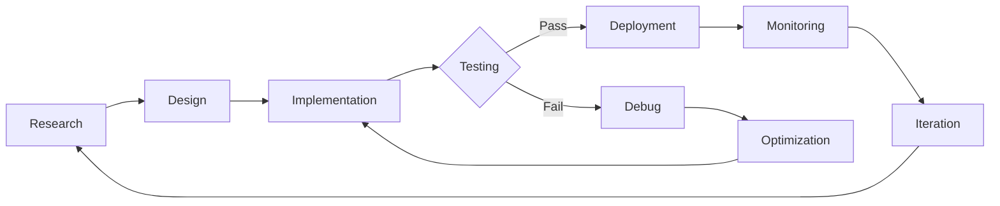

<div align="center">

# Hi, I'm Sachin 👋


### AI Engineer | Machine Learning Specialist | Deep Learning Enthusiast

[](https://git.io/typing-svg)

[](https://linkedin.com/in/sachin-m29)
[](mailto:sachin290805@gmail.com)
[](https://instagram.com/_sachx.n)


</div>

---

## 👨‍💻 About Me


I'm an **AI Engineer** specializing in machine learning, deep learning, and generative AI applications. With a strong foundation in computer science and hands-on experience in building production-ready ML systems, I'm passionate about leveraging artificial intelligence to solve real-world problems.

My expertise spans across developing end-to-end machine learning pipelines, implementing state-of-the-art deep learning architectures, and deploying scalable AI solutions.

```javascript
const profile = {
    role: "AI Engineer",
    specialization: ["Machine Learning", "Deep Learning", "Generative AI"],
    languages: ["Python", "JavaScript", "Java", "C"],
    frameworks: {
        ml: ["TensorFlow", "PyTorch", "Scikit-learn"],
        deepLearning: ["Neural Networks", "CNNs", "RNNs", "Transformers"],
        tools: ["Git", "Docker", "Jupyter", "VS Code"],
        databases: ["MySQL", "MongoDB"]
    },
    currentFocus: "Large Language Models & Generative AI"
};
```

<br clear="right"/>


---

## 🔬 Current Focus

<table>
<tr>
<td width="50%" valign="top">

###  Research & Development
-  Developing LLM-powered applications
-  Implementing Stable Diffusion models
-  Building production-ready ML pipelines
-  Exploring model interpretability techniques
-  Optimizing neural network architectures

</td>
<td width="50%" valign="top">

###  Learning & Growth
-  Advanced self-supervised learning
-  Reinforcement learning algorithms
-  MLOps and deployment best practices
-  Model optimization and compression
-  Ethical AI and responsible deployment

</td>
</tr>
</table>


---

## 🛠️ Technical Skills

<div align="center">

### Languages I Speak (To Computers)

<p align="center">
  <a href="https://www.python.org" target="_blank">
    
  </a>
  <a href="https://developer.mozilla.org/en-US/docs/Web/JavaScript" target="_blank">
    
  </a>
  <a href="https://www.java.com" target="_blank">
    
  </a>
  <a href="https://www.cprogramming.com/" target="_blank">
    
  </a>
  <a href="https://www.w3.org/html/" target="_blank">
    
  </a>
  <a href="https://www.w3schools.com/css/" target="_blank">
    
  </a>
</p>

###  ML/AI Arsenal

<p align="center">
  <a href="https://www.tensorflow.org" target="_blank">
    
  </a>
  <a href="https://pytorch.org/" target="_blank">
    
  </a>
  <a href="https://opencv.org/" target="_blank">
    
  </a>
  <a href="https://numpy.org/" target="_blank">
    
  </a>
  <a href="https://pandas.pydata.org/" target="_blank">
    
  </a>
  <a href="https://scikit-learn.org/" target="_blank">
    
  </a>
</p>

###  Development Tools

<p align="center">
  <a href="https://git-scm.com/" target="_blank">
    
  </a>
  <a href="https://github.com/" target="_blank">
    
  </a>
  <a href="https://code.visualstudio.com/" target="_blank">
    
  </a>
  <a href="https://jupyter.org/" target="_blank">
    
  </a>
  <a href="https://www.mysql.com/" target="_blank">
    
  </a>
  <a href="https://flask.palletsprojects.com/" target="_blank">
    
  </a>
  <a href="https://www.docker.com/" target="_blank">
    
  </a>
</p>

</div>


---

## 💼 Areas of Expertise

<div align="center">

<table>
<tr>
<td align="center" width="33%">

<h3>Machine Learning</h3>
<sub>Supervised & Unsupervised Learning<br>Ensemble Methods<br>Model Optimization</sub>
</td>
<td align="center" width="33%">

<h3>Deep Learning</h3>
<sub>CNNs & RNNs<br>Transformers & Attention<br>GANs & VAEs</sub>
</td>
<td align="center" width="33%">

<h3>Computer Vision</h3>
<sub>Image Classification<br>Object Detection<br>Image Segmentation</sub>
</td>
</tr>
<tr>
<td align="center" width="33%">

<h3>NLP</h3>
<sub>Text Generation<br>Sentiment Analysis<br>Large Language Models</sub>
</td>
<td align="center" width="33%">

<h3>Generative AI</h3>
<sub>Stable Diffusion<br>GPT Models<br>RAG Systems</sub>
</td>
<td align="center" width="33%">

<h3>Data Science</h3>
<sub>Data Analysis<br>Visualization<br>Feature Engineering</sub>
</td>
</tr>
</table>

</div>


---

## 📈 GitHub Statistics

<div align="center">


</div>


---

## 🏆 Achievements

<div align="center">


</div>


---

## 🔄 Development Workflow

<div align="center">



### Workflow Visualization

 → 
 → 
 → 
 → 
 → 


</div>


---

## 🎯 2025 Professional Goals

<div align="center">

<table>
<tr>
<td width="50%">

 Contribute to open-source AI/ML projects

 Publish research papers or technical articles

 Deploy production-grade ML models

</td>
<td width="50%">

 Mentor aspiring AI engineers

 Expand expertise in MLOps

 Develop innovative generative AI applications

</td>
</tr>
</table>

</div>


---

## 📚 Featured Projects

<div align="center">

<a href="https://github.com/Sachin-M-29">
  
</a>

<br><br>

 **Star repositories you find interesting!** 

</div>


---

## 💡 Professional Philosophy

<div align="center">


<br><br>

<table>
<tr>
<td align="center">

<br><br>
<em>"The science of today is the technology of tomorrow."</em>
<br>- Edward Teller
</td>
<td align="center">

<br><br>
<em>"Artificial intelligence is the new electricity."</em>
<br>- Andrew Ng
</td>
<td align="center">

<br><br>
<em>"First, solve the problem. Then, write the code."</em>
<br>- John Johnson
</td>
</tr>
</table>

</div>


---

## 📫 Let's Connect

<div align="center">


<br><br>

<a href="https://linkedin.com/in/sachin-m29">
  
</a>
<a href="mailto:sachin290805@gmail.com">
  
</a>
<a href="https://instagram.com/_sachx.n">
  
</a>

<br>


###  Open to Collaboration

<table>
<tr>
<td align="center">

<br>
<strong>Full-time Opportunities</strong>
<br>
<sub>AI/ML Engineering Roles</sub>
</td>
<td align="center">

<br>
<strong>Research Collaborations</strong>
<br>
<sub>Academic & Industry Projects</sub>
</td>
<td align="center">

<br>
<strong>Technical Writing</strong>
<br>
<sub>Publications & Articles</sub>
</td>
</tr>
<tr>
<td align="center">

<br>
<strong>Speaking Engagements</strong>
<br>
<sub>Workshops & Conferences</sub>
</td>
<td align="center">

<br>
<strong>Freelance Projects</strong>
<br>
<sub>AI Consulting & Development</sub>
</td>
<td align="center">

<br>
<strong>Mentorship</strong>
<br>
<sub>Guiding Aspiring Engineers</sub>
</td>
</tr>
</table>

<br>


### Thank you for visiting! Feel free to explore my repositories and reach out for collaborations.

<sub>Made with  by Sachin | AI Engineer</sub>

<br>


</div>
