<div align="center">

# HI There I'M Sachin


```ascii
   _____ _____ 
  / ____|_   _|
 | |  __  | |  
 | | |_ | | |  
 | |__| |_| |_ 
  \_____|_____|ngineer
```

[](https://git.io/typing-svg)

[](https://linkedin.com/in/sachin-m29)
[](mailto:sachin290805@gmail.com)
[](https://instagram.com/_sachx.n)


</div>

---

## 🧪 Who Am I? (Besides Someone Who Talks to Computers)


Hey there! I'm **Sachin**, an AI Engineer who occasionally remembers to eat while training models. I specialize in making machines smarter while questioning my own intelligence at 3 AM debugging sessions.

```javascript
const sachin = {
    pronouns: "He" | "Him",
    code: ["Python", "JavaScript", "Java", "C"],
    askMeAbout: ["AI", "ML", "Deep Learning", "Why my model won't converge"],
    technologies: {
        machineLearning: ["TensorFlow", "PyTorch", "Scikit-learn"],
        deepLearning: ["Neural Networks", "CNNs", "Transformers", "GANs"],
        tools: ["Git", "Docker", "Jupyter", "VS Code"],
        databases: ["MySQL", "MongoDB"],
        currentlyObsessedWith: "Generative AI"
    },
    funFact: "I've spent more time tuning hyperparameters than tuning my life"
};
```

<br/>

---

## 🎯 What I'm Up To (AKA Current Obsessions)

<table>
<tr>
<td width="50%">

### 🔬 In the Lab
- 🧠 Building **LLM-powered applications** that hopefully don't become sentient
- 🎨 Experimenting with **Diffusion Models** (making AI an artist)
- 📊 Creating **ML pipelines** that actually work in production
- 🔍 Researching **Model Interpretability** (trying to understand what the model learned)

</td>
<td width="50%">


### 📚 Learning Journey
- Self-supervised learning techniques
- Reinforcement learning (teaching AI by trial and error, like my life)
- MLOps best practices
- How to explain my work to non-technical people

</td>
</tr>
</table>

---

## 🛠️ My Toolbox (Things I Google Daily)

<div align="center">

### Languages I Speak (To Computers)


### AI/ML Arsenal


### Essential Tools


</div>

---

## 🎮 My Specialties (Boss Battles I've Conquered)

<div align="center">

<table>
<tr>
<td align="center" width="33%">

<h3>Machine Learning</h3>
<sub>Supervised • Unsupervised • Ensemble Methods</sub>
</td>
<td align="center" width="33%">

<h3>Deep Learning</h3>
<sub>CNNs • RNNs • Transformers • GANs</sub>
</td>
<td align="center" width="33%">

<h3>Computer Vision</h3>
<sub>Image Classification • Object Detection • Segmentation</sub>
</td>
</tr>
<tr>
<td align="center" width="33%">

<h3>NLP</h3>
<sub>Text Generation • Sentiment Analysis • LLMs</sub>
</td>
<td align="center" width="33%">

<h3>Generative AI</h3>
<sub>Stable Diffusion • GPT • RAG Systems</sub>
</td>
<td align="center" width="33%">

<h3>Data Science</h3>
<sub>Analysis • Visualization • Feature Engineering</sub>
</td>
</tr>
</table>

</div>

---

## 📊 GitHub Stats (Proof I Actually Code)

<div align="center">


</div>

---

## 🏆 Trophy Cabinet (Flex Zone)

<div align="center">


</div>

---

## 💻 My Workflow (Totally Realistic)

```mermaid
graph LR
    A[☕ Coffee] --> B[💡 Idea]
    B --> C[💻 Code]
    C --> D{🐛 Works?}
    D -->|Yes| E[🎉 Deploy]
    D -->|No| F[🔍 Debug]
    F --> G[📚 Stack Overflow]
    G --> C
    E --> H[😴 Sleep]
    H --> A
```



<div align="center">

### Alternative Workflow
 **→** 
 **→** 
 **→** 
 **→** 
 **→** 


</div>

---

## 🎯 2025 Goals (Let's See If I Actually Do These)

 Contribute to open-source AI projects  
 Publish research papers (or at least blog posts)  
 Deploy 5 production-ready ML models  
 Mentor aspiring AI engineers  
 Get 8 hours of sleep (lol jk)

---

## 🎪 Fun Facts About Me

<table>
<tr>
<td width="50%">

 **Debug Superpower**  
I can find bugs in my code 5 minutes after deployment

 **Coffee Stats**  
`coffee_consumed_per_day = ∞`

 **Best Coding Time**  
2 AM (when the bugs come out to play)

</td>
<td width="50%">

 **Documentation**  
"The code is self-documenting" - Famous last words

 **Social Life**  
`if social_life: pass  # Never executed`

 **Hobby**  
Arguing about Python vs. R (Python wins, obviously)

</td>
</tr>
</table>

---

## 🔝 Top Repositories That Survived Production

<div align="center">

<a href="https://github.com/Sachin-M-29">
  
</a>

</div>

---

## 💬 Wisdom from the Trenches

<div align="center">


### My Personal Mantras

>  *"It works on my machine" - Every developer ever*

>  *"There are only two hard things in Computer Science: cache invalidation and naming things"*

>  *"First, solve the problem. Then, write the code." - John Johnson*

</div>

---

## 📬 Let's Connect! (I Actually Reply)

<div align="center">


### Find Me Here

<a href="https://linkedin.com/in/sachin-m29">
  
</a>
<a href="mailto:sachin290805@gmail.com">
  
</a>
<a href="https://instagram.com/_sachx.n">
  
</a>

---

### 💡 Open for:
✅ Collaboration on AI/ML Projects  
✅ Freelance Opportunities  
✅ Coffee Chats about Tech  
✅ Debugging Sessions (yours, not mine... okay, maybe mine too)

---


### Thanks for stopping by! May your models converge and your GPUs stay cool 🚀

<sub>Made with ❤️, ☕, and an unhealthy amount of Stack Overflow</sub>

 **Star my repos if you find them useful!** 

</div>
