# Hi, I'm Sachin M 👋

### AI Engineer | Machine Learning Specialist | Deep Learning Enthusiast

---

## 👨‍💻 About Me

  

<table>
<tr>
<td width="50%">

I'm an **AI Engineer** specializing in machine learning, deep learning, and generative AI applications. With a strong foundation in computer science and hands-on experience in building production-ready ML systems, I'm passionate about leveraging artificial intelligence to solve real-world problems.

My expertise spans developing end-to-end machine learning pipelines, implementing state-of-the-art deep learning architectures, and deploying scalable AI solutions. I believe in writing clean, efficient code and staying at the forefront of AI innovation.

**Current Focus Areas:**
- 🤖 Large Language Models & RAG Systems
- 🎨 Generative AI & Stable Diffusion
- 📊 Production ML Pipeline Development
- 🔍 Model Optimization & Interpretability
- 🛠️ MLOps & Deployment Strategies

**Professional Values:**
- 💡 Continuous learning and innovation
- 🎯 Practical, impactful solutions
- 🤝 Collaboration and knowledge sharing
- 📈 Data-driven decision making

</td>
<td width="50%">

 

**When I'm not coding:**

*Debugging my life with coffee ☕*

</td>
</tr>
</table>

---

## 🎯 Current Focus

<table>
<tr>
<td width="50%" valign="top">

### 🔬 Research & Development
- 🤖 Developing LLM-powered applications with RAG
- 🎨 Implementing Stable Diffusion & image generation models
- ⚙️ Building scalable ML pipelines for production
- 🔍 Exploring advanced model interpretability techniques
- 🚀 Optimizing neural architectures for efficiency

</td>
<td width="50%" valign="top">

### 📚 Learning & Growth
- 💡 Advanced self-supervised learning techniques
- 🎮 Reinforcement learning & decision systems
- 🛠️ MLOps best practices & deployment strategies
- 📊 Model compression & edge deployment
- 🛡️ Ethical AI & responsible development

</td>
</tr>
</table>

---

## 🛠️ Technical Arsenal

### Programming Languages

  

### AI/ML Frameworks & Libraries

  
  
  
  

### Development Tools & Technologies

  
  

---

## 💼 Core Competencies

<table>
<tr>
<td align="center" width="33%">

<h3>Machine Learning</h3>

• Supervised & Unsupervised Learning 
• Ensemble Methods 
• Model Optimization & Tuning 
• Feature Engineering

</td>
<td align="center" width="33%">

<h3>Deep Learning</h3>

• CNNs & RNNs 
• Transformers & Attention 
• GANs & VAEs 
• Transfer Learning

</td>
<td align="center" width="33%">

<h3>Computer Vision</h3>

• Image Classification 
• Object Detection & Tracking 
• Image Segmentation 
• Video Analysis

</td>
</tr>
<tr>
<td align="center" width="33%">

<h3>Natural Language Processing</h3>

• Text Generation 
• Sentiment Analysis 
• Large Language Models 
• Named Entity Recognition

</td>
<td align="center" width="33%">

<h3>Generative AI</h3>

• Stable Diffusion 
• GPT Models & Fine-tuning 
• RAG Systems 
• Prompt Engineering

</td>
<td align="center" width="33%">

<h3>Data Science</h3>

• Exploratory Data Analysis 
• Statistical Modeling 
• Data Visualization 
• A/B Testing

</td>
</tr>
</table>

---

## 📈 GitHub Analytics

---

## 🏆 GitHub Achievements

---

## 🔄 My Development Philosophy

```mermaid
graph LR
    A[🔍 Research] --> B[📐 Design]
    B --> C[💻 Implementation]
    C --> D{🧪 Testing}
    D -->|✅ Pass| E[🚀 Deployment]
    D -->|❌ Fail| F[🐛 Debug]
    F --> G[⚡ Optimization]
    G --> C
    E --> H[📊 Monitoring]
    H --> I[🔄 Iteration]
    I --> A
    
    style A fill:#00D9FF,stroke:#0099CC,stroke-width:2px,color:#000
    style E fill:#00FF88,stroke:#00CC66,stroke-width:2px,color:#000
    style D fill:#FFD700,stroke:#FFA500,stroke-width:2px,color:#000
    style F fill:#FF6B6B,stroke:#CC5555,stroke-width:2px,color:#000
```

---

## 🎯 2025 Professional Roadmap

| 🎯 Goal | 📝 Description | 🗓️ Timeline |
|---------|---------------|------------|
| 🤝 Open Source | Contribute to major AI/ML projects | Q1-Q4 |
| 📄 Publications | Publish technical articles & research | Q2-Q3 |
| 🚀 Production ML | Deploy scalable ML systems | Q1-Q2 |
| 👨‍🏫 Mentorship | Guide aspiring AI engineers | Ongoing |
| 🛠️ MLOps Mastery | Advanced deployment & monitoring | Q2-Q3 |
| ✨ GenAI Apps | Build innovative generative AI solutions | Q3-Q4 |

---

## 💡 Words I Code By

<table>
<tr>
<td align="center" width="33%">
  
<em>"The science of today is the technology of tomorrow."</em> 
<strong>— Edward Teller</strong>
</td>
<td align="center" width="33%">
  
<em>"Artificial intelligence is the new electricity."</em> 
<strong>— Andrew Ng</strong>
</td>
<td align="center" width="33%">
  
<em>"First, solve the problem. Then, write the code."</em> 
<strong>— John Johnson</strong>
</td>
</tr>
</table>

 

---

## 📫 Let's Connect & Collaborate

  

### 🌐 Find Me Online

 

### 🤝 Open For Opportunities

<table>
<tr>
<td align="center" width="33%">
 
<strong>Full-Time Roles</strong> 
AI/ML Engineering Positions
</td>
<td align="center" width="33%">
 
<strong>Collaborations</strong> 
Research & Industry Projects
</td>
<td align="center" width="33%">
 
<strong>Freelance Work</strong> 
AI Consulting & Development
</td>
</tr>
<tr>
<td align="center" width="33%">
 
<strong>Technical Writing</strong> 
Articles & Publications
</td>
<td align="center" width="33%">
 
<strong>Speaking</strong> 
Workshops & Conferences
</td>
<td align="center" width="33%">
 
<strong>Mentorship</strong> 
Guiding Future Engineers
</td>
</tr>
</table>

 

### Thanks for stopping by! 

**Let's build something amazing together!** 🚀

 

 

Crafted with ❤️ and ☕ by Sachin | AI Engineer | Turning Coffee into Code

 

